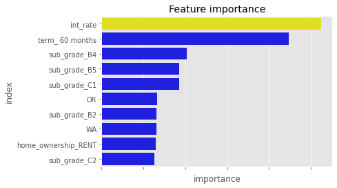

# LendingClub Credit Risk Prediction


# Business Problem

- LendingClub is the financial service company, which provide borrowing, banking and investing products to general customers, small business and institutions
- Unsecured Consumer Loan is the primary product that brings high yield to the company
- This project is to build a model to help LendingClub prevent below cases
- - Business loss- rejecting a borrower who is actually able to repay the loan
- - Capital loss- approving a borrower who ends up not being able to repay the loan 

# Data

- LendingClub loan dataset
- Data range from 2007 to 2018
- 2.3M applications
- 151 features
- Data features: loan status, interest rate, grade/subgrade, home ownership,annual income,employment length, etc
- Target variable: loan status
- [Data Source](https://www.kaggle.com/datasets/wordsforthewise/lending-club)

# Methods

- Clean null values and outliers in the dataset
- Convert categorical variables into dummy variable for fitting machine learning models
- Select the features for modeling
- Due to the fact that the existing dataset is not balanced, which means that there are many more customers with clear loan status than customers who default, I used the sampling method to address this issue
- The datasize is large, so the major class was undersampled


# Model

- Logistics Regression Model, Decision Tree Model, Random Forest Model and XGBoost Model were used to train the data
- XGBoost Model has recall score 68% and accuracy score 66%
- Tuning parameter in XGBoost Model to improve performance

## Baseline Model

- Random Forest Model
- Out of all the loans that actually did default, the model predicted this outcome correctly for 68% of those loans
- Out of all the loans that the model predicted would not default, 64 % actually did not


## Final Model

- Recall score improved in XGBoost Model 
- Out of all the loans that actually did default, the model predicted this outcome correctly for 68% of those loans
- Out of all the loans that the model predicted would not default, 64 % actually did not
- In this case, I chose the model with high precision score and high recall score
- High precision: Not many loan defaults were predicted as good loans
- High recall: Predicted most loan defaults correctly


# Features Importance



# Recommendation

- Balance transer- recommend borrower pay down  existing credit card debt 
- Loan consolidation- consolidate the loans into a fixed-rate term loan
- Joint application- borrowers may receive a better rate when they jointly apply for a personal loan

# Future Improvements

- Further analysis for higher annual income and higher FICO score customers- help the bank to make specific products for this group of customers
- Target to members’ core needs - utilize  a scalable technology platform to  lower the cost of their debt and/or improve the returns on their savings

- Attract new members - target to potential customers who search loan information by search engines or social media. Offer incentive to  current customer  by relationship referrals.  Advertise through the website, targeted online advertising, online aggregation partners, or direct mail
- Retain current members -offer return members with better rate if they need another loan or deposit product which increases the lifetime value of members while helping them improve their financial health

# Repository Structure

```
├── README.ipynb
├── images
├── Lending Club_Presendtation.pdf
├──.gitignore
├── Prediction_original.ipynb
├── README.md
├── Project Proposal.pdf
├── notebook_project_loan_1.pdf
└── selected_features.csv

```


```python

```
